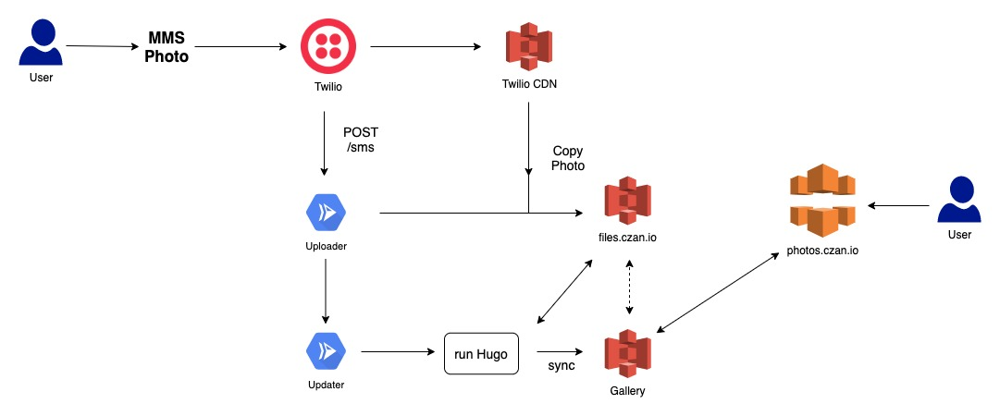

# Photo Gallery
Source for https://photos.czan.io

## Summary
This is a photo gallery that supports MMS photo uploads using Twilio MMS. 

## How it works
Text a photo to the secret phone number, and your photo will be uploaded to https://photos.czan.io.

## Architecture

## Components
This project is comprised of three services:

### Gallery
This is a Hugo template that comprises the static site content. It is indended to be hosted on S3.

### Uploader
This is an API that serves as an endpoint for Twilio MMS webhooks. This service determines if the sender is allowed, then copies the uploaded photo from Twilio's CDN to our photo bucket. After the file is copied it calls the Updater service to update the website.

### Updater
This service updates the gallery as photos are uploaded or deleted.